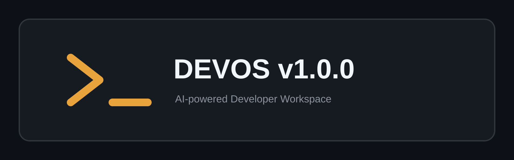

# DEVOS v1.0.0

> AI-powered Developer Workspace with Git, AI Assistant, Terminal, and GitHub Integration.

[](./01-docs/README.md)

[](https://www.python.org/)
[](https://react.dev/)
[](https://www.typescriptlang.org/)
[](./LICENSE)
[](./02-frontend/public/manifest.webmanifest)

**Project links:** [Live Demo](#live-demo) · [Documentation](./01-docs/README.md) · [Deployment Checklist](./01-docs/deployment/DEPLOYMENT_CHECKLIST.md) · [Release Notes](./01-docs/releases/RELEASE_NOTES.md) · [Rollback Plan](./01-docs/deployment/ROLLBACK_PLAN.md)

## Project Status

| Area | Status |
| --- | --- |
| Backend, API, Git, workspace | Ready |
| Frontend build and responsive UI | Ready |
| Automated tests | 48 passing |
| GitHub OAuth and repository dashboard | Implemented |
| Production deployment | Human-owned configuration required |

## Features

| Workspace | Intelligence | Delivery |
| --- | --- | --- |
| Project-scoped files and explorer | Context-aware AI assistant | Git status, branches, commits |
| Allowlisted terminal | Local/Mock, Gemini, or OpenAI providers | Testing center |
| GitHub OAuth and repository browser | Secret-aware context sanitization | PWA installability |

## Architecture

```text
React + TypeScript + Vite
          │ HTTPS / JSON API
          ▼
FastAPI ── SQLAlchemy async ── SQLite or PostgreSQL
   ├── project-scoped file/workspace storage
   ├── allowlisted terminal and Git services
   ├── GitHub OAuth (server-side tokens)
   └── AI provider adapters
```

## Repository Structure

```text
02-frontend/   React, TypeScript, and Vite client
03-backend/    FastAPI service and database layer
04-tests/      API and unit test suites
01-docs/       Architecture, operations, security, and product docs
.github/       Community health files and CI/security workflows
```

## Quick Start

### Backend

```bash
cd 03-backend
python -m venv .venv
# Windows: .venv\Scripts\activate
# Linux/macOS: source .venv/bin/activate
pip install -r requirements.txt
copy .env.example .env  # Windows; use cp on Linux/macOS
uvicorn app.main:app --reload --port 8000
```

The backend defaults to a local SQLite database (`./devos.db`) and creates
tables automatically on startup. No external services are required. To use
PostgreSQL instead, set `DATABASE_URL` in `.env` and run
`alembic upgrade head`.

Interactive API documentation is available at `http://localhost:8000/api/v1/docs`.

### Frontend

```bash
cd 02-frontend
npm ci
npm run dev
```

The Vite server proxies `/api` to `http://localhost:8000`. Override it with `VITE_API_PROXY_TARGET`.

### Tests and build

```bash
python -m ruff check 03-backend
python -m pytest -q 04-tests
cd 02-frontend
npm run build
```

## Screenshots

The public landing page includes an accessible workspace illustration. Add reviewed product screenshots to `docs/assets/` before publishing external marketing material.

## Live Demo

No production demo URL has been verified yet. Configure the deployment first,
then replace this note with the owned public URL.

## Release Status

**DEVOS v1.0.0 Release Candidate**. Production deployment and public demo URL
remain human-owned configuration steps.

## Tech Stack

- **Frontend:** React 18, TypeScript, Vite, React Router, Lucide
- **Backend:** FastAPI, SQLAlchemy async, Pydantic Settings
- **Data:** SQLite locally; PostgreSQL supported for deployment
- **Quality:** Ruff, pytest, TypeScript, Vite build, GitHub Actions

## Roadmap

- Container or OS-level isolation for terminal workloads
- Production observability and privacy-preserving analytics
- Expanded repository import and collaboration flows
- Formal Lighthouse and multi-browser release gates

## Documentation

Start at [01-docs/README.md](./01-docs/README.md). Security details are in [01-docs/security/SECURITY.md](./01-docs/security/SECURITY.md); API and deployment references are linked there.

## Contributing

Read [CONTRIBUTING.md](./.github/CONTRIBUTING.md), open an issue using the provided template, and include reproducible steps and verification evidence.

## Support

- Email: [mdkhaleelurrahman51@gmail.com](mailto:mdkhaleelurrahman51@gmail.com?subject=DEVOS%20v1.0.0%20Support)
- Phone: [+91 78428 35936](tel:+917842835936)

## License

DEVOS v1.0.0 is released under the [MIT License](./LICENSE).
